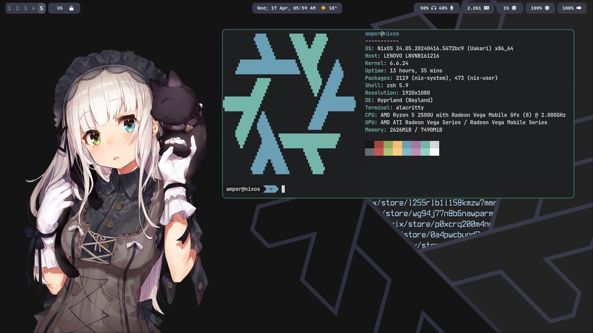

# ❄️ My NixOS Config

## Описание

Это конфигурация NixOS, которая позволяет настроить вашу систему в соответствии с вашими предпочтениями. Оригинал конфигурации доступен по следующей ссылке: [GitHub Repository](https://github.com/Andrey0189/nixos-config).

## Установка

Чтобы установить конфигурацию, выполните следующие команды в терминале:

```bash
git clone https://github.com/Andrey0189/nixos-config
mv nixos-config $HOME/nix  # Конфигурация должна находиться в директории ~/nix
cd $HOME/nix
```

## Настройка

Перед использованием конфигурации вам нужно внести некоторые изменения, связанные с вашим оборудованием:

- **UUID диска**: Убедитесь, что UUID вашего диска правильно указан.
- **Имя пользователя**: Измените имя пользователя на ваше в файлах:
  - `users.nix`
  - `xserver/home.nix`
  - `flakes.nix`
  - Также проверьте `configuration.nix`.

- **Замена hardware-configuration.nix**: Замените файл `hardware-configuration.nix` на сгенерированный вами файл.

## Дополнительные настройки

- Конфигурация ссылается на обои, которые находятся в ваших загрузках. Проверьте файл `home-manager/modules/wms/hyprland.nix`:

  ```bash
  swww img ~/Downloads/nixos-chan.png
  ```

- Проверьте настройки монитора в том же файле.

- Также проверьте файл `home-manager/modules/wms/git.nix` и измените данные на ваши.

## Применение конфигурации

После внесения всех изменений выполните следующие команды для применения конфигурации:

```bash
sudo nixos-rebuild switch --flake .
home-manager switch --flake .
```

## Наслаждайтесь!

